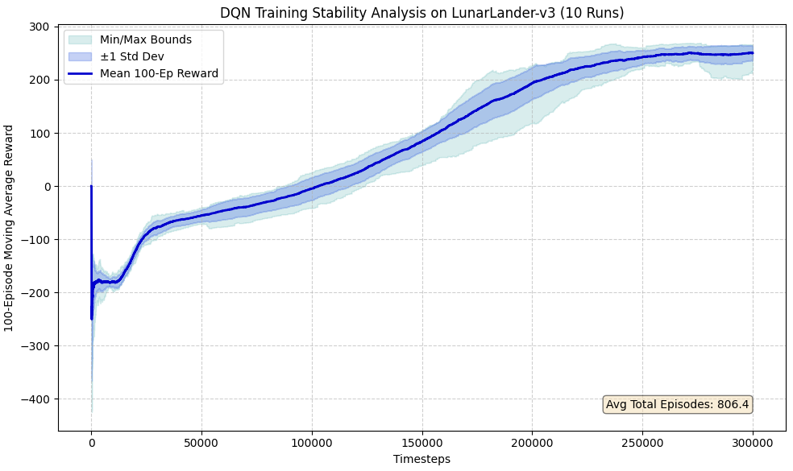
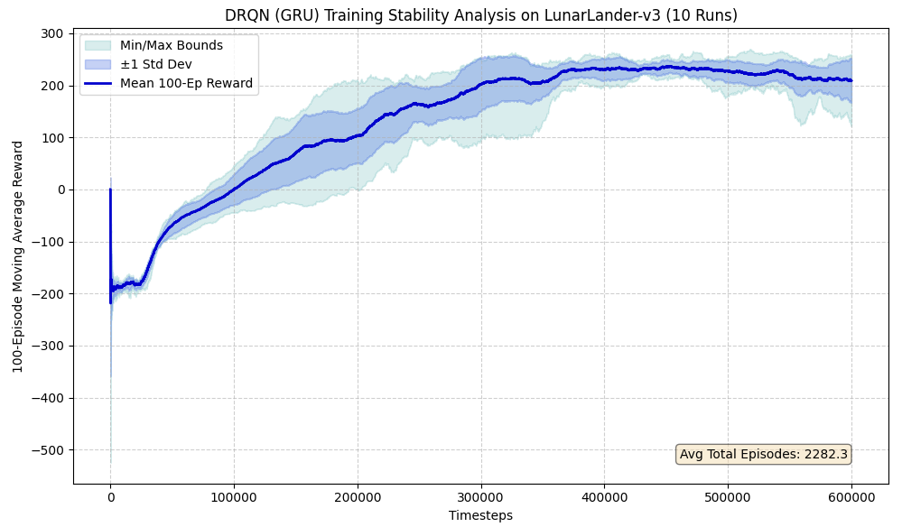
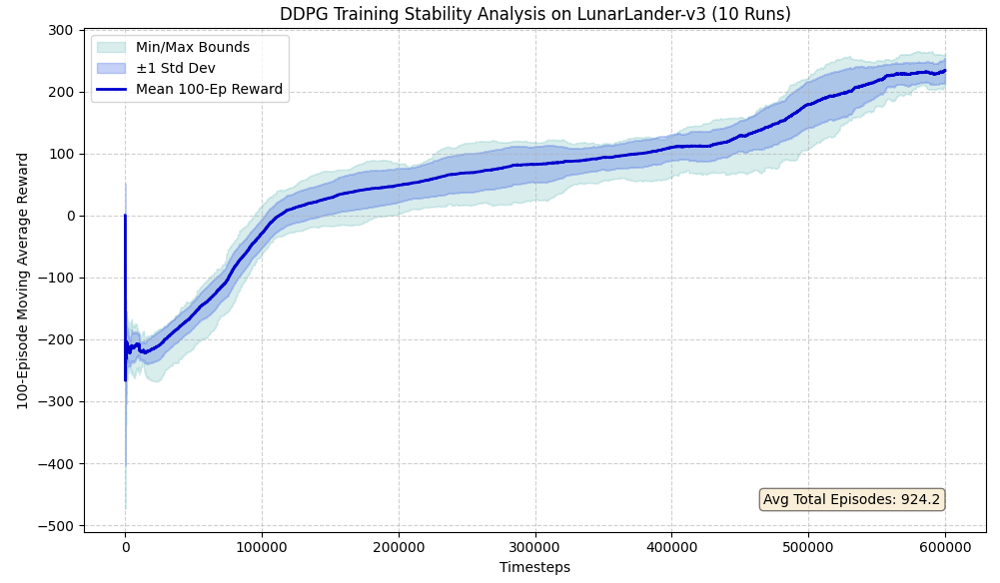
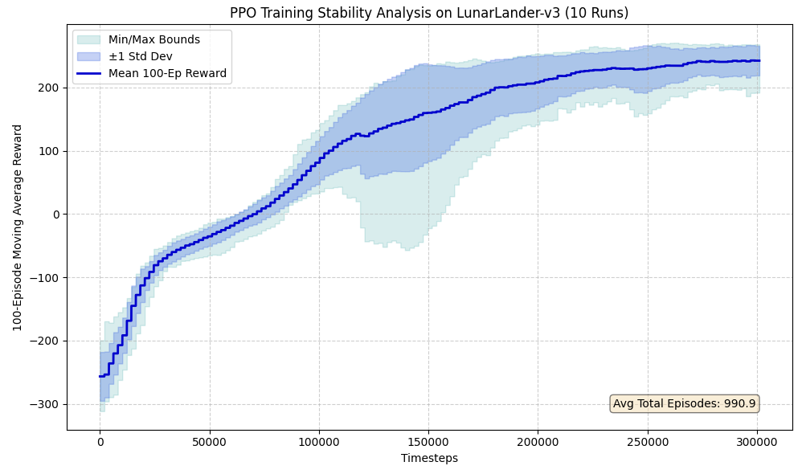

# Deep Neural Networks Final Project

## Evaluating Value-Based and Actor-Critic Methods on the Lunar Lander Environment 🚀
 
**Author:** Sapkas Michail

**Student ID:** 2154102

**Email:** michail.sapkas@phd.unipd.it

---

## Course Submission

**Submitted for the course of Prof. Giorgio Carlo Buttazzo** 

**PhD Program in Technologies for Fundamental Research in Physics and Astrophysics** 

**Dipartimento di Fisica ed Astronomia "Galileo Galilei"** 

**UNIVERSITÀ DEGLI STUDI DI PADOVA & INFN SEZIONE DI PADOVA** 

July 10, 2026

---

# The Lunar Lander Environment

The *Lunar Lander* environment, maintained within the Farama Foundation's *Gymnasium* library \[\[^1]], is a classic rocket trajectory optimization problem widely utilized as a benchmark task in reinforcement learning (RL). The simulation models a spacecraft attempting to land safely on a designated landing pad surrounded by a randomized, uneven lunar terrain. The primary objective is to pilot the vehicle from the top to the coordinate origin $(0,0)$ which is the designated landing pad flanked by two flags, while minimizing fuel consumption, balancing orientation, and ensuring zero final touchdown velocity. An episode terminates if the lander crashes, flies out of bounds, or comes to a complete rest. Additionally, to prevent infinite hovering states, the environment enforces a strict time-limit truncation after a maximum of $1000$ timesteps.

## Observation Space

The environment provides the agent with an 8-dimensional observation vector, which describes the exact physical state of the lander at any given timestep $t$:

* **$x, y$ Coordinates:** The horizontal and vertical position of the lander relative to the landing pad.
* **$v\_x, v\_y$ Velocities:** The linear horizontal and vertical velocities.
* **$\\theta, \\omega$ Orientation:** The angular orientation of the lander relative to the horizontal plane ($\\theta$), and its corresponding angular velocity ($\\omega$).
* **Leg Contact Booleans:** Two binary values ($c\_{\\text{left}}, c\_{\\text{right}} \\in {0, 1}$) indicating whether the left leg and/or the right leg are in physical contact with the ground terrain.

## Action Space

To accommodate different control constraints, the environment supports two operational modes:

* **Discrete Control (Default):** The action space is defined as $A = {0, 1, 2, 3}$, where the agent chooses from four distinct binary thruster activations: (0) *Do nothing*, (1) *Fire left orientation engine*, (2) *Fire main engine*, and (3) *Fire right orientation engine*.
* **Continuous Control:** The action space is defined by a two-dimensional vector $a\_t \\in \[-1, 1]^2$. The first element controls the main engine throttle, while the second element regulates the lateral boosters.

## Reward Structure and Termination

The cumulative reward structure can be outlined as follows:

* **Progress and Velocity:** Rewards scale positively as the lander moves closer to the landing pad and decreases its linear velocity.
* **Orientation:** Penalties are applied if the lander tilts away from a stable horizontal posture.
* **Thrust Penalty:** Main engine firing incurs a minor penalty of $-0.3$ points per frame, and side thruster firing incurs $-0.03$ points per frame to discourage wasteful fuel expenditure.
* **Touchdown Incentives:** Each leg making ground contact awards a $+10$ bonus. A successful landing between the flags with near-zero velocity yields a culminating bonus of $+100$ points. Conversely, crashing or flying completely outside the viewport limits triggers an immediate terminal penalty of $-100$ points.

An episode terminates when the lander crashes, ventures entirely out of bounds, or comes to a complete rest on the lunar surface. The task is formally considered "solved" when an RL agent consistently achieves an average cumulative episode score of $\\ge 200$ points over consecutive trials.

## Known Issues and Training Dynamics

A primary challenge in training the agent is the sequential discovery of stable sub-behaviors. Early in the training lifecycle, the agent typically learns to stabilize its orientation and achieve a localized hovering state to avoid immediate crash penalties. However, this configuration frequently acts as a local minimum. Because the main engine constantly fires to maintain altitude, the agent routinely exhausts its 1000-step action budget, resulting in episode truncation without achieving a successful touchdown. It typically requires several training epochs for the policy to overcome this hovering policy, decouple the fear of crashing from the landing objective, and safely guide the vehicle to a graceful descent within the designated landing zone.

\---

# Deep Q-Networks (DQN)

The Deep Q-Network (DQN) architecture \[\[^2]] utilizes a feed-forward neural network to approximate the optimal action-value function, $Q^\*(s, a)$. The network maps the 8-dimensional observation vector through two hidden dense layers of 128 neurons each, culminating in an output layer of 4 neurons representing the discrete action space. Consequently, at each operational timestep, the agent maintains immediate access to an estimation of the expected cumulative future reward for each of the four possible actions.

To stabilize training, an experience replay buffer with a maximum capacity of 100,000 transition tuples is implemented. The training pipeline initializes with a 10,000-step warmup period during which actions are sampled purely uniformly at random to populate the buffer. Following this phase, optimization occurs at a training frequency of every 4 environment steps. Network stability is maintained using a separate target network updated every 100 steps via a Polyak (soft) update rule with a smoothing coefficient of $\\tau = 0.5$. The maximum horizon for the training process is strictly capped at a total of 300,000 environment steps. The $\\gamma$ value is set to $0.99$. To navigate the exploration-exploitation trade-off within the discrete action space, two distinct action-selection mechanisms were evaluated for the DQN agent.

## $\\epsilon$-Greedy Exploration

This strategy balances exploration and exploitation by selecting a completely random action with probability $\\epsilon$, and the greedy action (maximizing the current $Q$-value estimation) with probability $1-\\epsilon$. To transition from pure exploration to exploitation as training progresses, the exploration rate is geometrically decayed at each episode boundary according to the following parameter configuration:
$\\epsilon\_{\\text{start}} = 1.0, \\epsilon\_{\\text{decay}} = 0.9945, \\epsilon\_{\\text{min}} = 0.02$.

  
   
  <em>Figure 1: One training run with ϵ-Greedy DQN Rewards</em>

  
   
  <em>Figure 2: 10 DQN Training Runs using ϵ-Greedy Exploration</em>

### Training Performance and Convergence Analysis

In retrospect, the baseline DQN utilizing an $\\epsilon$-greedy exploration strategy emerged as one of the most robust and dependable approaches for this discrete control task. The algorithm demonstrated exceptional sample efficiency, achieving steady monotonic convergence to the target average reward threshold of $\\ge 200.0$ within approximately $200,000$ environment steps, all while avoiding the severe performance oscillations.

An analysis of the standard deviation and min-max tracking boundaries reveals a highly stable initialization period followed by consistent, predictable progress toward the landing objective. Crucially, the agent successfully navigated the notoriously difficult policy transition between mid-air hovering and terminal descent without experiencing catastrophic forgetting or policy regression.

## Boltzmann (Softmax) Exploration

An alternative mechanism for managing the exploration-exploitation trade-off is Boltzmann (or Softmax) exploration. Instead of selecting an action strictly at random, this strategy maps the estimated $Q$-values of all available actions to a categorical probability distribution.

The selection probability $P(a|s)$ for an action $a$ given the environmental state $s$ is governed by the Softmax function parameterized by a temperature variable $\\tau\_{\\text{temp}}$ and using the stabilization trick of subtracting the maximum value of the four possible $Q$-values:

$$P(a|s) = \\frac{\\exp\\left(\\frac{Q(s, a) - \\max(Q(s, a))}{\\tau\_{\\text{temp}}}\\right)}{\\sum\_{j} \\exp\\left(\\frac{Q(s, j) - \\max(Q(s, a))}{\\tau\_{\\text{temp}}}\\right)}$$

The temperature parameter controls the entropy of the action selection: a high temperature approaches a purely uniform random distribution, while a low temperature concentrates on the maximum estimated $Q$-values, approaching a greedy policy. The temperature is geometrically decayed at each episode boundary according to the following parameter configuration:

$$\\begin{align\*}
\\tau\_{\\text{start}} \&= 2.0 \\
\\tau\_{\\text{decay}} \&= 0.97 \\
\\tau\_{\\text{min}} \&= 0.1
\\end{align\*}$$

  
   
  <em>Figure 3: One complete DQN Training run with Boltzmann exploration</em>

  
   
  <em>Figure 4: 10 DQN Training Runs using Boltzmann exploration</em>

### Training Performance and Convergence Analysis

The training trajectory of the DQN agent employing Boltzmann exploration exhibits a mean curve progression remarkably similar to that of its $\\epsilon$-greedy counterpart. Because the presented curves illustrate the ensemble mean of 10 independent training runs tracking the rolling 100-episode average reward, the fundamental convergence trends naturally align despite the localized differences in exploratory stochasticity.

However, a highly prominent feature unique to the Boltzmann method is the localized performance collapse and sudden expansion of the variance boundaries observed during the critical phase transition from mid-air hovering to a stabilized terminal landing. This instability may be driven by the sensitivity of this phase in choosing the correct action and also highlights the heightened sensitivity of the Softmax formulation to early hyperparameter schedules. Nonetheless, the fact that both exploration methods ultimately require an identical mean number of episodes per run and terminate at the same peak expected reward confirms the robustness of the method.

## Deep Recurrent Q-Networks (DRQN)

To evaluate the impact of temporal modeling, a Deep Recurrent Q-Network (DRQN) \[\[^3]] utilizing a Gated Recurrent Unit (GRU) \[\[^4]] was implemented. Theoretically, because the Lunar Lander observation space encapsulates full state visibility, the Markov property holds, and introducing a recurrent memory mechanism should yield negligible architectural advantages. However, exploring recurrent dynamics in this domain provides valuable empirical insights into sequence-based optimization constraints.

### Network Architecture

The standard feed-forward architecture is replaced with a sequential recurrent model structured as follows:

1. **Embedding Layer:** A dense linear layer maps the 8-dimensional observation vector to a latent space of $284$, passing through an Exponential Linear Unit (ELU) activation function.
2. **Recurrent Core:** A Gated Recurrent Unit (GRU) processes the latent embeddings across a target sequence length of $T = 92$.
3. **Output Head:** The resulting hidden state vector of the GRU is mapped through a dense linear layer to an output layer of 4 neurons, computing the action-value estimations.

### Hyperparameter Optimization and Setup

Due to the acute sensitivity of the recurrent agent to its parameter configuration, automated hyperparameter optimization was conducted via the Optuna framework \[\[^5]] on a remote server. This search yielded precise, non-standard parameter values optimized specifically for stability.

Action exploration is governed by an $\\epsilon$-greedy strategy, decaying geometrically at episode boundaries from $\\epsilon\_{\\text{start}} = 1.0$ down to $\\epsilon\_{\\text{min}} = 0.01$ with a decay factor of $\\epsilon\_{\\text{decay}} = 0.993$. The optimization parameters are configured with a discount factor $\\gamma = 0.984$ and a soft Polyak target update smoothing coefficient of $\\tau = 0.415$. Both the training execution frequency and the target network update interval are set to occur every $20$ environment steps; aligning these two update frequencies proved to be a critical factor in maintaining policy stability. Consistent with the baseline DQN, the training horizon is strictly bounded at a maximum of $400,000$ total environment steps.

### Episode-Based Replay Buffer and Sample Balancing

Transitioning to a recurrent framework requires a structural overhaul of the experience replay mechanism. Rather than storing individual transition tuples, the buffer retains complete, variable-length episodes to preserve continuous historical sequences, keeping a capacity of $500$ completed episodes. The training pipeline initializes with a $250$-episode warm-up period populated via a uniform random action policy.

To properly calculate target $Q$-values over the temporal sequence, the sampling function extracts a contiguous window of $99$ consecutive steps ($\\text{Burn-In Length} + T + 1 = 6 + 92 + 1$). This specific window size allows the network to process a 6-step burn-in period, execute a 92-step training slice, and maintain a 1-step temporal shift to capture the look-ahead state $s\_{t+1}$ required for the target network.

If a sampled episode contains fewer transitions than the required 99-step window, the sequence undergoes dynamic front-padding using zero-valued dummy tensors. Front-padding ensures that critical terminal transitions remain tightly locked to the final indices of the mini-batch, preserving temporal alignment. However, passing a zero-vector through the non-linear embedding layer of a neural network still yields an arbitrary, non-zero $Q$-value prediction. To prevent the network from backpropagating through these meaningless artifacts and introducing value-estimation noise into the recurrent core, a terminal mask is explicitly applied by setting $d\_t = 1.0$ for all padded frames. This modification forces the temporal difference target calculation:

$$y\_t = r\_t + \\gamma \\max\_{a'} Q\_{\\text{target}}(s\_{t+1}, a') (1 - d\_t)$$

to mathematically neutralize the look-ahead bootstrap term since $(1 - d\_t) = 0$. Consequently, the target for padded regions evaluates to a clean, constant $r\_t = 0.0$, allowing the network to isolate its gradient updates exclusively to the real environmental observations.

Furthermore, a sample-balancing strategy is enforced to overcome the sparsity of successful landing trajectories. During each training iteration, the sampling mechanism blends $128$ purely random sequences with $25$ explicitly chosen terminal sequences. These terminal sequences are filtered and drawn from episodes that achieved a true environmental termination ($\\text{terminated} = \\text{True}$), forcing the sampling window to catch the end of the episode and ensuring the agent frequently encounters the high-reward signals necessary to master a graceful touchdown.

### Hidden State Management and Burn-In Period

A major architectural challenge in DRQN training involves the initialization of the GRU's hidden state during batch updates. Reinitializing the hidden state to zero at the start of each arbitrary sub-sequence distorts temporal dependencies and causes severe training instability. To mitigate this, the step-by-step hidden states are preserved directly inside the replay buffer during environmental rollouts. When a sequence is sampled for training, its recurrent history is initialized using the exact recorded hidden state from the preceding timestep.

To allow the hidden state to stabilize and adapt to the latent history before gradient accumulation begins, a *burn-in* period of $6$ timesteps is enforced. The model processes the first $6$ frames of the sequence through a forward pass without tracking gradients. For sequences that have been front-padded due to short episode lengths, the initial hidden state defaults safely to a zero-initialized tensor ($\\mathbf{0} \\in \\mathbb{R}^{1 \\times 1 \\times 284}$), and the network utilizes the un-averaged padded steps to warm up recurrent values before gradient calculation.

  
   
  <em>Figure 5: One training run using a GRU with the DRQN algorithm</em>

  
   
  <em>Figure 6: 10 DRQN Training Runs</em>

### Training Performance and Convergence Analysis

Designing, coding, and deploying the DRQN architecture undoubtedly represented the most labor-intensive and creatively demanding component of this project. Due to the addition of sequential dependencies, the recurrent core exhibited significant training instability and required substantial hyperparameter tuning to prevent gradient exploding and value-estimation noise. Furthermore, the empirical results indicate that a recurrent agent demands a slightly longer training horizon (measured in total environmental timesteps) to comfortably settle its hidden state dynamics and fully converge to an optimal control solution.

Despite these optimization hurdles and the acute sensitivity of the recurrent layers, the network successfully demonstrated a remarkably steady, upward learning trend. The GRU proved capable of consolidating temporal history over extended horizons to gradually improve its flight profiles. This steady progression suggests that while recurrent networks introduce severe training overhead and structural complexity in fully observable domains, they possess a robust capacity for systematic policy improvement when granted adequate temporal stabilization.

\---

# Deep Deterministic Policy Gradient (DDPG)

To tackle the continuous variant of the Lunar Lander problem, the framework transitions from value-based discrete estimation to an actor-critic paradigm via the Deep Deterministic Policy Gradient (DDPG) \[\[^6]] algorithm. This modification alters the underlying control task: instead of choosing from four discrete engines, the agent must output a continuous two-dimensional vector $a\_t \\in \[-1, 1]^2$ regulating the main throttle and lateral boosters simultaneously.

### Network Architectures and Interfacing

DDPG decouples the policy selection from the state-value estimation by introducing two distinct functional components, both utilizing a latent dimensionality of $128$ neurons across two hidden dense layers and using learning rates of $\\alpha\_{\\text{actor}} = \\alpha\_{\\text{critic}} = 1\\times10^{-3}$:

* **The Actor Network:** Maps the 8-dimensional observation vector directly to the continuous action space. The output layer passes through a hyperbolic tangent ($\\tanh$) activation function, bounding the resulting action elements strictly within the interval $\[-1, 1]$.
* **The Critic Network:** Exhibits an important structural divergence from traditional value function configurations. Instead of estimating $Q$-values solely from state inputs, the critic acts as an action-value estimator $Q(s, a)$. The 2-dimensional continuous action tensor is concatenated directly with the 8-dimensional state vector at the input layer, constructing a combined 10-dimensional feature representations slice handled by sequential dense hidden layers with Rectified Linear Unit (ReLU) activations.

### Exploration Noise and Replay Mechanics

Exploration is implemented by adding additive Gaussian noise directly to the deterministic actor outputs during environmental interactions:

$$a\_t = \\text{clip}\\left(\\mu\_\\theta(s\_t) + \\mathcal{N}(0, \\sigma\_t), -1.0, 1.0\\right)$$

The standard deviation parameter controls the explorative entropy, initializing at $\\sigma\_{\\text{start}} = 1.0$ and geometrically decaying at episode boundaries by a factor of $\\sigma\_{\\text{decay}} = 0.998$ down to a minimum baseline of $\\sigma\_{\\text{min}} = 0.05$.

Transitions are gathered in a step-granular experience replay buffer. Rather than stopping at a fixed number of episodes, training was governed by a continuous loop that required the rolling 100-episode average reward to maintain a score of $\\ge 200.0$ for a stable sequence of $N\_{\\text{consecutive}} = 10$ consecutive episodes. Any drop below the 200.0 baseline instantly reset the validation hold counter to zero. The warm-up period is $10,000$ steps during which actions are sampled purely uniformly at random. Once this capacity threshold is crossed, optimization steps and Polyak soft updates occur simultaneously at a regular train frequency of every 4 environmental steps using a tight target tracking coefficient of $\\tau = 0.005$.

### Optimization Chain (Training Step)

During a training iteration, a uniform mini-batch of size $64$ is sampled. In this implementation a much larger replay buffer of 300,000 experiences was introduced. The optimization process updates both network parameters concurrently:

1. **Critic Loss Optimization:** Target $Q$-values are assembled by passing look-ahead states $s\_{t+1}$ through the target actor and target critic under zero-gradient tracking, forming the Temporal Difference (TD) target:

   $$y\_t = r\_t + \\gamma Q\_{\\phi'}\\left(s\_{t+1}, \\mu\_{\\theta'}(s\_{t+1})\\right)(1 - d\_t)$$

   The critic parameters are then adjusted by minimizing the mean-squared error (MSE) loss: $\\mathcal{L}(\\phi) = \\frac{1}{N}\\sum (Q\_\\phi(s\_t, a\_t) - y\_t)^2$.

2. **Actor Loss Optimization:** The actor is updated via gradient ascent on the critic's output, formulated as the negative mean of the predicted action-value distributions:

   $$\\mathcal{L}(\\theta) = -\\frac{1}{N}\\sum Q\_\\phi\\left(s\_t, \\mu\_{\\theta}(s\_t)\\right)$$

  
   
  <em>Figure 7: One training run with the DDPG algorithm</em>

  
   
  <em>Figure 8: 10 DDPG Training Runs capped at 600,000 steps</em>

### Training Performance and Convergence Analysis

The DDPG implementation demonstrated exceptional training stability and policy robustness throughout its execution, avoiding major divergence loops. However, a highly prominent characteristic of this algorithm is its extensive computational timeline, requiring more than double the total environmental timesteps of the baseline DQN to reach full convergence.

Interestingly, while the mean number of training episodes per run was only marginally higher (approximately 100 additional episodes), the cumulative step count expanded drastically. This indicates that a DDPG agent takes significantly more environment steps to resolve each individual episode. In a continuous control setting, the agent must fine-tune a complex, two-dimensional continuous thrust mapping rather than executing coarse discrete choices and consequently, early-to-mid-stage policies often lead to prolonged, cautious hovering trajectories before a terminal landing or crash is triggered.

\---

# Proximal Policy Optimization (PPO)

For the last RL algorithm a Proximal Policy Optimization (PPO) \[\[^7]] agent was implemented. PPO shifts the paradigm from off-policy deterministic tracking to an on-policy stochastic framework. This methodology optimizes a clipped surrogate objective function to ensure that policy updates do not deviate drastically from the historical behavioral policy, stabilizing policy gradients without requiring a dedicated target architecture.

### Network Architectures and Stochastic Interfacing

The actor and critic configurations are designed as decoupled networks using a compact latent structure of $64$ neurons across two hidden dense layers utilizing Rectified Linear Unit (ReLU) activations:

* **The Actor Network:** Utilizes a shared dense feature extractor that splits into two independent linear heads. The first head parameterizes the mean ($\\mu$) and it is bounded via a hyperbolic tangent ($\\tanh$) activation function. The second head outputs the log-standard deviation ($\\log \\sigma$), establishing a state-dependent variance. To protect the distribution from exponential explosion or numerical collapse under extreme state inputs, this vector is clamped strictly within $\[-20, 2]$. These outputs parameterize a continuous Gaussian distribution, $\\mathcal{N}(\\mu, \\sigma)$, from which actions are stochastically sampled during environmental collection.
* **The Critic Network:** Functions as a state-value estimator $V^\\phi(s)$. It processes the 8-dimensional observation vector through its sequential dense layers, culminating in a single linear neuron that outputs the expected cumulative discounted return from that state.

The networks are optimized independently using separate Adam configurations, applying a restricted learning rate of $\\alpha\_{\\text{actor}} = 1\\times10^{-4}$ to ensure conservative policy shifts, while the critic leverages a faster rate of $\\alpha\_{\\text{critic}} = 1\\times10^{-3}$.

### Trajectory Collection and Generalized Advantage Estimation (GAE)

As an on-policy algorithm, PPO alternates between environmental data collection and optimization phases. Trajectories are gathered over a fixed horizon of $T\_{\\text{horizon}} = 2048$ timesteps, storing states, actions, rewards, terminal masks, and the corresponding log-probabilities ($\\log \\pi\_{\\theta\_{\\text{old}}}(a\_t|s\_t)$) of the behavioral policy.

To achieve an optimal balance between bias and variance when evaluating policy trajectories, Generalized Advantage Estimation (GAE) \[\[^8]] is performed over the collected buffer. For a discount factor $\\gamma = 0.99$ and a smoothing hyperparameter $\\lambda = 0.95$, the temporal difference (TD) residual $\\delta\_t$ and the generalized advantage estimator $\\hat{A}\_t$ at step $t$ are computed as follows:

$$\\begin{align}
\\delta\_t \&= r\_t + \\gamma V^\\phi(s\_{t+1})(1 - d\_t) - V^\\phi(s\_t) \\
\\hat{A}*t \&= \\sum*{l=0}^{\\infty} (\\gamma \\lambda)^l \\delta\_{t+l}
\\end{align}$$

These computed advantages are subsequently normalized across the batch to stabilize the gradient variance during backpropagation.

### The Clipped Surrogate Objective

During the optimization phase, the stored trajectory buffer is processed across $10$ PPO epochs using small mini-batches of size $32$. The policy updates maximize the clipped surrogate objective function:

$$\\mathcal{L}^{\\text{CLIP}}(\\theta) = \\hat{\\mathbb{E}}\_t \\left\[ \\min\\left( r\_t(\\theta)\\hat{A}\_t, , \\text{clip}(r\_t(\\theta), 1-\\epsilon, 1+\\epsilon)\\hat{A}\_t \\right) \\right]$$

where $r\_t(\\theta) = \\frac{\\pi\_\\theta(a\_t|s\_t)}{\\pi\_{\\theta\_{\\text{old}}}(a\_t|s\_t)}$ represents the probability ratio between the new and old policies, and $\\epsilon = 0.2$ defines the strict clipping boundary that prevents destructive policy over-updates.

The total loss minimized by the optimizer is formulated as:

$$\\mathcal{L}^{\\text{TOTAL}}(\\theta, \\phi) = -\\mathcal{L}^{\\text{CLIP}}(\\theta) + c\_1 \\mathcal{L}^{\\text{VF}}(\\phi) - \\alpha\_{\\text{entropy}} \\mathcal{H}\\left(\\pi\_\\theta(s)\\right)$$

With a fixed $\\alpha\_{\\text{entropy}}$ parameter of 0.001.

  
   
  <em>Figure 9: One training run with the PPO algorithm</em>

  
   
  <em>Figure 10: 10 PPO Training Runs</em>

### Gradient Norm Clipping

To preserve network numerical stability, gradients are clipped whenever their total $L\_2$ norm exceeds $c\_{\\text{max}} = 0.5$. In practice, restricting the magnitude of the gradient updates in this manner was crucial for policy convergence, effectively guarding against destabilizing updates during the mini-batch optimization phase.

### Training Performance and Convergence Analysis

While PPO ultimately demonstrated robust convergence and exceptional sample efficiency, achieving this level of performance required meticulous hyperparameter optimization and tuning. Empirical trials revealed that without careful parameter selection, the algorithm frequently encountered an optimization ceiling, failing to surpass an average reward threshold of approximately $150.0$ (signifying that the agent remains close to, but short of, the optimal landing target), and occasionally suffering from complete policy divergence.

PPO proved to be the best framework for this continuous control task. A key behavioral advantage of the policy was the execution of remarkably natural, smooth, and safe flight maneuvers during the final terminal landing phase. Furthermore, the algorithm exhibited superior step-to-episode throughput, completing nearly $1,000$ full episodes within the strict $300,000$ total.

\---

# Concluding Remarks

This project evaluated several value-based and actor-critic reinforcement learning algorithms on both the discrete and continuous variants of the Lunar Lander environment. While more complex methods like DRQN and DDPG successfully handled sequential data and continuous control, they also introduced greater training instability and required significantly more time to converge. Conversely, DQN and PPO emerged as the most robust and reliable approaches, likely because their structural design aligns well with the fully observable and relatively compact nature of this specific environment.

Ultimately, the primary takeaway from these experiments is the extreme sensitivity of all evaluated algorithms to their hyperparameters. The difference between smooth learning and complete policy failure heavily depended on fine-tuning engineering details. This underscores that choosing a powerful algorithm is not enough; careful parameter tuning and stabilization techniques remain the true deciding factors in successfully solving non-linear control tasks.

\---

## 📚 References

\[^1]: Towers et al. (2025). *Gymnasium: A Standard Interface for Reinforcement Learning Environments*. [Farama Foundation](https://farama.org/).
\[^2]: Mnih et al. (2013). *Playing Atari with Deep Reinforcement Learning*. [arXiv:1312.5602](https://arxiv.org/abs/1312.5602).
\[^3]: Hausknecht \& Stone (2015). *Deep Recurrent Q-Learning for Partially Observable MDPs*. [arXiv:1507.06527](https://arxiv.org/abs/1507.06527).
\[^4]: Chung et al. (2014). *Empirical Evaluation of Gated Recurrent Neural Networks on Sequence Modeling*. [arXiv:1412.3555](https://arxiv.org/abs/1412.3555).
\[^5]: Akiba et al. (2019). *Optuna: A Next-generation Hyperparameter Optimization Framework*. [ACM Digital Library](https://dl.acm.org/doi/10.1145/3330732.3366117).
\[^6]: Lillicrap et al. (2015). *Continuous Control with Deep Reinforcement Learning*. [arXiv:1509.02971](https://arxiv.org/abs/1509.02971).
\[^7]: Schulman et al. (2017). *Proximal Policy Optimization Algorithms*. [arXiv:1707.06347](https://arxiv.org/abs/1707.06347).
\[^8]: Schulman et al. (2015). *High-Dimensional Continuous Control Using Generalized Advantage Estimation*. [arXiv:1506.02438](https://arxiv.org/abs/1506.02438).

